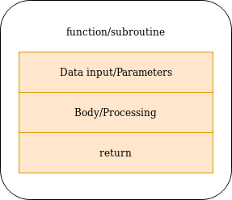
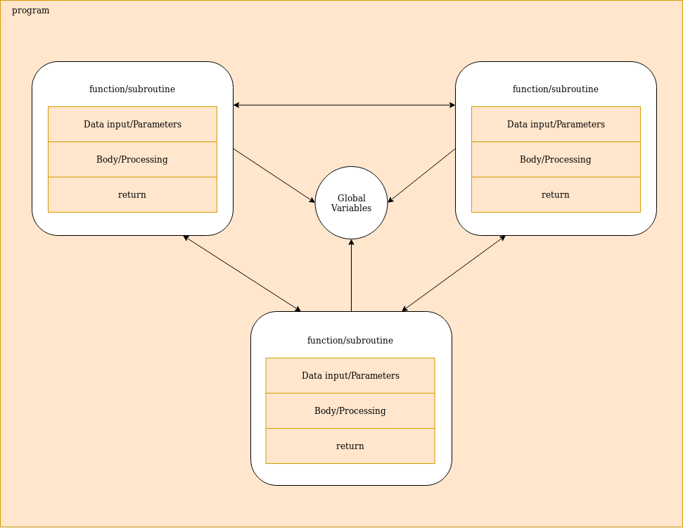
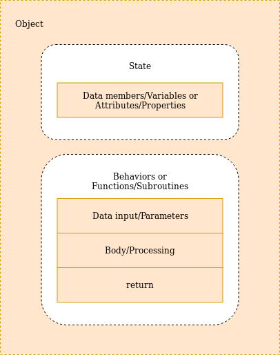
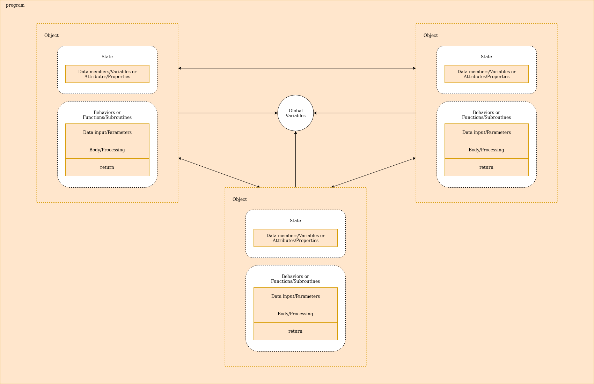

    

        Welcome to the PewdiePie's favourite blog about Software Engineering and today's
        topic is <b>Objects and Data Strcutures</b>...
    

    <h3>Procedural vs Object Oriented programming</h3>
    

        Before getting into the differences between these two imperative ways of writing code
        I would like to explain what subroutines are...
    

    <h4>Subroutines</h4>
    

        Subroutines are a sequence of programming instructions/expressions/clauses
        that performs a specific task. They are also known as functions/methods/procedures/subprograms 
        depending on the language.
         
        Some say that these four are different. Maybe they are...but that's not the point.
    

    

        The intent behind them is <b>maintainability</b> becasue they increases
        the code reusability and readability. Larger and complex programs can be break down into
        little blocks.
         
        That being said, now you know that the purpouse of creating them is to reuse blocks 
        of code or execute a specific task whenever it is needed but also create a structured
        code that is easier to read and mantain.
    

    

        Every subroutine have a way of receiving data (data input), processing data (body)
        and a return (branch back) to actually return a value (or not) to it's caller once the task
        is done.
    

    
    

        They can be declared within a program or in separetaly libs, like the ones that are used to access system
        resources and services on linux operating system. A good example would be the GNU C Library. 
    

    

        I'm not getting much into this so I'm gonna put some good references at the end of the post
        if you want to explore more about subroutines and how they works in a more lower-level representation
        and hopefully I'm not getting any problems with copyright...
         
        And here is a example of a subroutine/function in Python:
    

    <pre class="brush: python">
<code>def sum(first, second):
    return first + second</code>
</pre>
    <h4>Procedural Programming</h4>
    
In procedural programming, programs are composed in mostly by, guess what, 
        procedures or subroutines.
         
        Some results can be achieved by writing programs that doesn't have custom subroutines
        which means that they only have variable declaraitons and uses built-in functions.
    

    

        But this is like almost impossible to see if we are talking about programs that does requires more complex logic.
    

    

        Programs written using this paradigm have global data members and behavior members that
        can acesses all global members. Which means that the behavior members, the subroutines, can operate
        directly on the main program's data:
    

    
    

        So as you can see the functions or subroutines can access each other inside the program, access the global variables to change the state of the program and, of course, the program itself can access all of them and dictate how this iteration is gonna happen. 
    

    

        Functions can be declared whithin the file of the program or in external files.
        This helps to organize the structure of the progam.
    

    <h4>Top to bottom execution</h4>
    

      Procedural programs are executed top to bottom. This means that every line of code
      is executed one after another till the end of the statements.
    

    <h4>Object Oriented Programming</h4>
    

        In Oriented Programming the program is composed mainly by Objects.
        This is a higher level of code reusability where the functions are tied up in objects along with the necessary data members or properties that represents the object's state or model.
         
        This means that objects have it's own data members or variables and it's own set
        of behaviors to change it's state.
    

    
    
    <!-- IMAGE -->
    

        In procedural programming, the author of the code have to organize the functions the best way he can to represent a behavior that can be related to a representation of a object. For instance:
    

    <pre class="brush: python">
<code>notify(cellphone, message)</code>
</pre>
    

        Using OOP this could be achieved by doing something like this:
    

    <pre class="brush: python">
<code>cellphone.notify(message)</code>
</pre>
    

        There are some other factors like the fact that global variables can be changed at any time by any function in procedural programs, which is not very good.
    

    

        Of course, as you coud see on the last image, objects can also access global variables but the idea of using objects is not only to represent real world objects or components inside of the program, but also that 
        they only work (mostly) with their own data structures (data members), isolating them from changes on the program's state and to encapsulate
        data and behavior members data contains details useful only for the object itself by making them private.
    

    

        Encapsulation of objects is also a way of preventing the object's state to change during the code execution by other users of the same object and reduce
        complexity. This also helps with debbuging because we would have only one place
        to look up, which is the template of the object (the class).
    

    

        Object Oriented Programming makes the code cleaner, and with another level of organization if they are used correctly.
        Of course, in procedural programming functions can be in external files and organized by similar behaviors and things like that.
         
        But it's different when you have a function attached to a object. We can see exactly on what the function is operating and what we can expect.
    

    

        And of course, because programming languages where made by humans to humans, the OOP have some principles like, inheritance, encapsulation, abstraction and polymorphism to help us to manipulate or create objects in different contexts with different variations of representation...
    

    <h3>The freedom of our objects</h3>
    

        Now that we've revised some super important concepts we can get to some observations.
    

    <h4>Data abstraction</h4>
    

        Abstraction is the process of hiding details, so <b>data abstraction</b> would be
        the process of hiding data members of a object or class.
         
        This not only helps to prevent
        their state from changes made by users, but also makes the code readable and maintainable by making it
        less polluted and limiting the places where those states can be changed other than the class/object itself.
         
        In other words, data abstraction heltps to manage complexity and makes the process of debugging easier.
    

    

        Members are encapsulated by changing their accessibility to private. But even though
        those members can only be accessed inside of the class/object, the author can expose
        public interfaces to manipulate them.
         
        With data members it's common to have what is called <b>property accessors</b> or <b>getters/setters</b>
        that allow users of a object to manipulate those data members.
    

    

        Even though this can be useful in some cases, they actually should be avoided if there isn't 
        a good reason to use them.
         
        Creating getters and setters just for the saking of getting or setting values of variables
        is more like a false encapsulation. Any user of the object can change it's state
        as if the data members where actually public.
    

    

        Of course property accesors can help in some cases. Setters could have
        some validation making the user of the object to provide the right value. Or maybe some datatype conversion
        to a type that is useful internally. But other than that, they don't have much of a meaning.
    

    

        When it comes to getters, they are more useful than setters in most of the cases actually.
        Sometimes the user of the object only need to check it's state.
        A good example would be a cart on a e-commerce website. The cart could have some behaviors like:
        amountOfItems(), isFull(), items() and maybe one interface to actually update the cart, update(List items).
    

    

        Make sure that you have a good reason to add them into your code. Also make sure that they
        are not breanking the method's or funtiction's contract, I mean, that they are saying that do one thing but,
        in reality, they are doing something else.
    

    

        <b>getItems()</b> and <b>setItems(List items)</b> makes users to expected to manipulate those attributes
        whenever they want. But they actually can have, as I said before, validations, data conversions and so on.
         
        It's best that objects have public interfaces that actually hides the implementation of their attributes by exposing
        only the necessary interfaces and returning a abstract value for getters, like the <b>amountOfItems()</b>
        or <b>isFull()</b> and avoid returning the attribute itsel. Not allowing users of the object to set
        attributes directly, isntead, expose interfaces that will actually be a meaningful layer between the object user
        and the internal implementation with a descriptive name like <b>cart.update(List items)</b>, <b>car.add(Lugagge lugagge)</b> and so on.
    

    <h3>Data/Object Anti-Symmetry</h3>
    

        There is two ways in wich classses can be used: Objects and Datastructures.
    

    

        Although some people think that OOP can achieved only by adding classes to the project
        this is not quite true.
         
        There is a slightly differecen between creating objects from a class and creating data structures from a class.
    

    <h4>Objects</h4>
    

        Object are compose by data mebmers wich can be (and should at the most part) encapsulated and behaviors and the data members
        that operates on that data.
    

    <h4>Data Strctures</h4> 
    

        Data strucutres only exposes data and doesn't have any meaningful behavior members.
    

    <h4>Wich is more appropriate to use?</h4>
    <h3>The law of demeter</h3>
    <h3>Data Transfer Objects</h3>
    Good Luck XD

